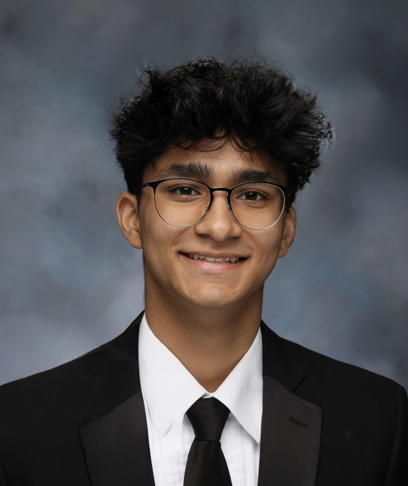
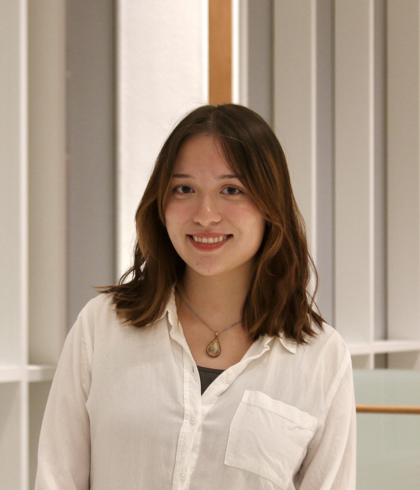
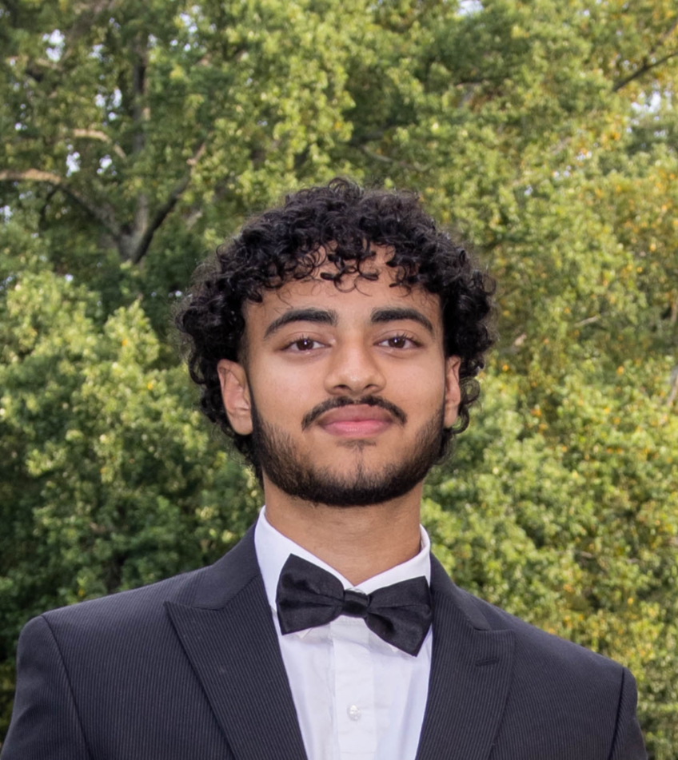

# 🎁 Kisses for Kyle Gift Registry

This repository contains the source code for the Kisses for Kyle Gift registry platform that powers the annual Kisses for Kyle holiday gift drive. The Kisses for Kyle Foundation offers a variety of services to families fighting childhood cancer in the Delaware Valley.

## Tech Stack

- **Framework:** [Tanstack Start + React](https://tanstack.com/start/latest)
- **Build Tool:** [Vite](https://vitejs.dev/)
- **Language:** [TypeScript](https://www.typescriptlang.org/)
- **Styling:** [Tailwind CSS](https://tailwindcss.com/)
- **UI Components:** [shadcn/ui](https://ui.shadcn.com/), [Radix UI](https://www.radix-ui.com/)
- **Data Fetching:** [TanStack Query](https://tanstack.com/query/latest)
- **Routing:** [Tanstack Router](https://tanstack.com/router/latest)
- **Schema Validation:** [Zod](https://zod.dev/)

## Directory Structure

```
kfk-gift-registry/
├── app/          # TanStack Start web application (React, Vite)
├── common/       # Shared TypeScript types and utilities
├── functions/    # Firebase Cloud Functions
├── firebase.json # Firebase project and emulator configuration
└── package.json  # Root package.json with workspace-level scripts
```

## Running Locally

> [!IMPORTANT]
> Prerequisites: [Node.js v24](https://nodejs.org/) and [pnpm](https://pnpm.io/) installed, plus the [Firebase CLI](https://firebase.google.com/docs/cli) (`pnpm i -g firebase-tools`).

1. Install dependencies:

   ```sh
   pnpm install
   ```

2. Build the shared `common` package (required before first run):

   ```sh
   pnpm --filter common run build
   ```

3. Start the development environment:

   ```sh
   pnpm dev
   ```

   This launches the Firebase emulators (Auth, Firestore, Functions, Storage) and the TanStack Start dev server via the App Hosting emulator. The app will be available at `http://localhost:5002` and the Firebase Emulator UI at `http://localhost:4000`.

## Meet the Team

### 🧭 Product Managers
<table align="center">
  <tr>
    <td align="center" width="160">
      <br/>
      <b>Vishesh Khare</b><br/>
      
    </td>
    <td align="center" width="160">
      <br/>
      <b>Tarun Kommuri</b><br/>
      
    </td>
  </tr>
</table>

### 🛠 Tech Leads
<table align="center">
  <tr>
    <td align="center" width="160">
      <br/>
      <b>Arnav Gupta</b><br/>
      
    </td>
    <td align="center" width="160">
      <br/>
      <b>Ramy Kaddouri</b><br/>
      
    </td>
  </tr>
</table>

### 🎨 Designers
<table align="center">
  <tr>
    <td align="center" width="160">
      <br/>
      <b>Zayneb Omer</b><br/>
      
    </td>
    <td align="center" width="160">
      <br/>
      <b>Najma Karissa Arfa</b><br/>
      
    </td>
  </tr>
</table>

### 💻 Engineers
<table align="center">
  <tr>
    <td align="center" width="160">
      <br/>
      <b>Akhila Pasupunuri</b><br/>
      
    </td>
    <td align="center" width="160">
      <br/>
      <b>Dennis Huynh</b><br/>
      
    </td>
    <td align="center" width="160">
      <br/>
      <b>Edward Song </b><br/>
      
    </td>
  </tr>
  <tr>
    <td align="center" width="160">
      <br/>
      <b>Maggie McAndrew</b><br/>
      
    </td>
    <td align="center" width="160">
      <br/>
      <b>Nadia Meyerovich</b><br/>
      
    </td>
    <td align="center" width="160">
      <br/>
      <b>Ori Marx</b><br/>
      
    </td>
  </tr>
  <tr>
    <td align="center" width="160">
      <br/>
      <b>
        <a href="https://www.linkedin.com/in/syednahm">
          Nazeer Ahmed
        </a>
      </b><br/>
      
    </td>
  </tr>
</table>

---

## Points of Contact

| Name          | Role            | Email                     |
| ------------- | --------------- | ------------------------- |
| Ramy Kaddouri | Tech Lead       | rkaddour@terpmail.umd.edu |
| Arnav Gupta   | Tech Lead       | agupta67@terpmail.umd.edu |
